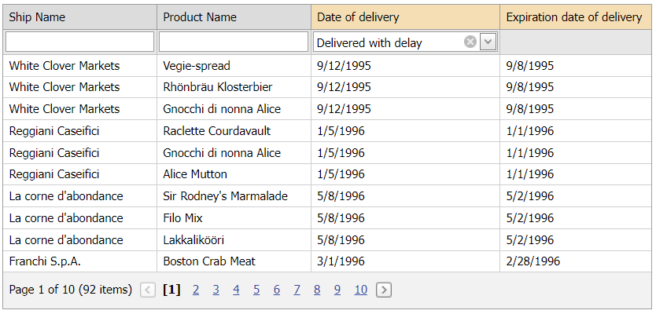

<!-- default badges list -->

[](https://supportcenter.devexpress.com/ticket/details/T546944)
[](https://docs.devexpress.com/GeneralInformation/403183)
<!-- default badges end -->
# Grid View for ASP.NET Web Forms - How to apply custom function filter criteria operators
<!-- run online -->
**[[Run Online]](https://codecentral.devexpress.com/128533360/)**
<!-- run online end -->

This example demonstrates how to use a [CriteriaPatchBase](https://supportcenter.devexpress.com/ticket/details/t320172/how-to-traverse-through-and-modify-the-criteriaoperator-instances) class descendant to apply a [custom function criteria operator](https://docs.devexpress.com/eXpressAppFramework/113480/filtering/in-list-view/custom-function-criteria-operators).



## Overview

Assign a custom function operator to the grid's [FilterExpression](https://docs.devexpress.com/AspNet/DevExpress.Web.ASPxGridBase.FilterExpression) property. For the auto filter row, handle the grid's server-side [ProcessColumnAutoFilter](https://docs.devexpress.com/AspNet/DevExpress.Web.ASPxGridView.ProcessColumnAutoFilter) event as follows:

```cs
protected void Grid_ProcessColumnAutoFilter(object sender, DevExpress.Web.ASPxGridViewAutoFilterEventArgs e) {
    var grid = (ASPxGridView)sender;
    if(e.Column.FieldName == SpecialFilterColumnFieldName && e.Kind == GridViewAutoFilterEventKind.CreateCriteria) {
        grid.FilterExpression = UpdateGridFilterExpression(grid, e);
        e.Criteria = null;
    }
}
```

Handle the grid's server-side [AutoFilterCellEditorInitialize](https://docs.devexpress.com/AspNet/DevExpress.Web.ASPxGridView.AutoFilterCellEditorInitialize) event to assign the custom criteria operator value to the filter editor.

```cs
protected void Grid_AutoFilterCellEditorInitialize(object sender, ASPxGridViewEditorEventArgs e) {
    var grid = (ASPxGridView)sender;
    if(e.Column.FieldName == SpecialFilterColumnFieldName) {
        var gridCriteria = CriteriaOperator.Parse(grid.FilterExpression);
        e.Editor.Value = CriteriaVisitor.GetCustomFunctionOperatorValue(gridCriteria, e.Column.FieldName);
    }
}
```

## Files to Review

* [CriteriaPatcherBase.cs](./CS/App_Code/CriteriaPatcherBase.cs) (VB: [CriteriaPatcherBase.vb](./VB/App_Code/CriteriaPatcherBase.vb))
* [CriteriaVisitor.cs](./CS/App_Code/CriteriaVisitor.cs) (VB: [CriteriaVisitor.vb](./VB/App_Code/CriteriaVisitor.vb))
* [MyCustomFunctionOperator.cs](./CS/App_Code/MyCustomFunctionOperator.cs) (VB: [MyCustomFunctionOperator.vb](./VB/App_Code/MyCustomFunctionOperator.vb))
* [Default.aspx](./CS/Default.aspx) (VB: [Default.aspx](./VB/Default.aspx))
* [Default.aspx.cs](./CS/Default.aspx.cs) (VB: [Default.aspx.vb](./VB/Default.aspx.vb))

## Documentation

* [The base implementation of the IClientCriteriaVisitor interface for the CriteriaOperator expression patcher](https://supportcenter.devexpress.com/ticket/details/t320172/how-to-traverse-through-and-modify-the-criteriaoperator-instances)
